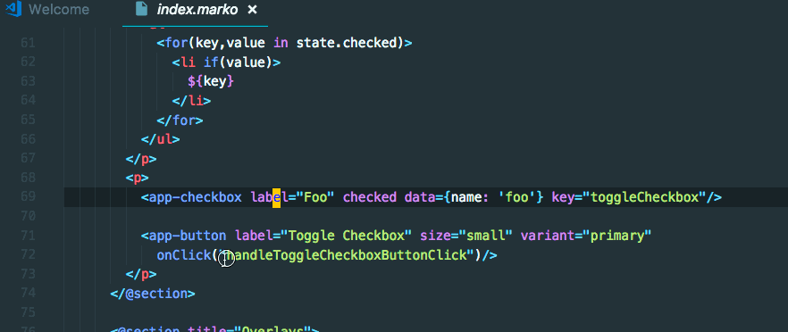

Marko VSCode
======================

Marko tooling for VS Code, powered by [marko-language-server](../../server)

# Features
- [X] Go To Definition
- [ ] Autocompletion
- [ ] Syntax HighLighting (There is another extension for this: https://marketplace.visualstudio.com/items?itemName=pcanella.marko)
- [ ] Tag Matching
- [ ] Linting
- [ ] Debugging

# Demo
## Go to Definition
- Go To Tags

- Custom Attribute Names

- Custom Handlers

# Development

We include a `.vscode` directory that contains run configuration for developers.
You can find three settings that will help you get started. The workflow will be
explained in the following items:

* Run `$ npm install` install dependencies for the extension and the server.
* Run `$ npm run watch` to compile and re-compile the client and server in the background on each change.
* open this folder in VS Code. In the Debug viewlet, run the 'All' task, this will open a new vscode instance and attach debuggers for the client and server code.
* Open your Marko project (You can use https://github.com/marko-js-samples/ui-components-playground to experiment as well)
* Now you can add breakpoints to the client and the server. If you change any code, you might want to restart the debug session so that all your changes get loaded.

# License

Use of this source code is governed by an MIT-style license that can be found in
the LICENSE file or at https://opensource.org/licenses/MIT.
 
